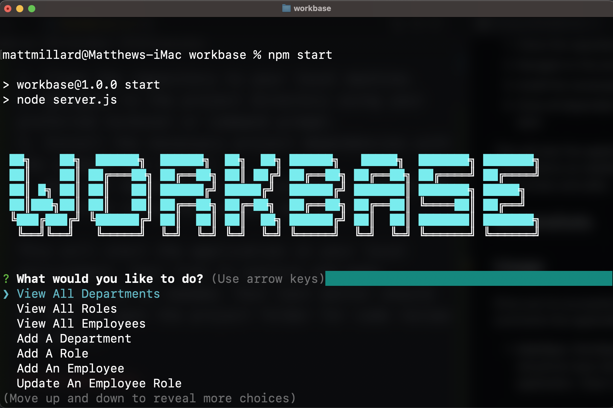
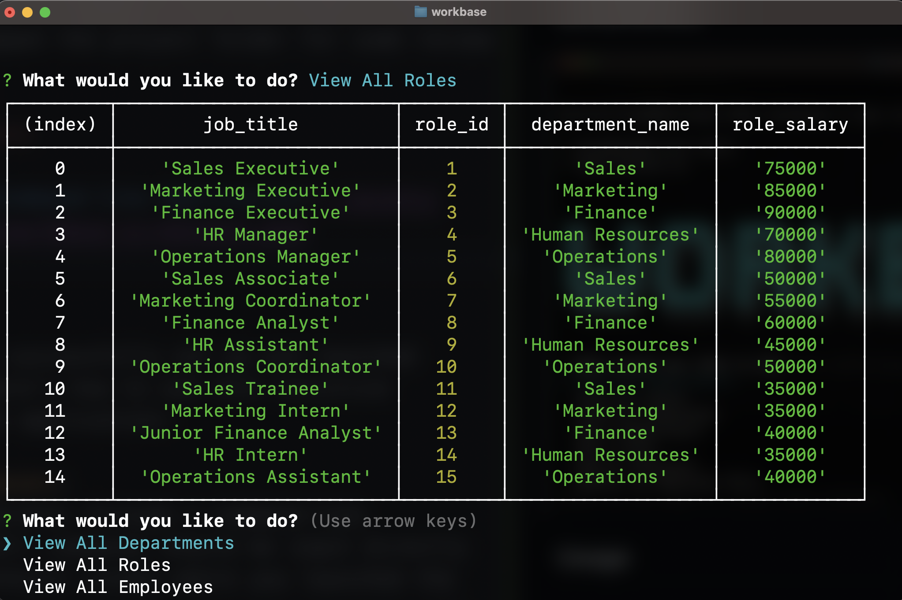

# WorkBase

## Description

WorkBase is an intuitive command-line application powered by MySQL, specifically tailored for business owners. Streamlining the management of employee records, WorkBase ensures efficient organization and effortless retrieval within your database.

## Table Of Contents

- [Project Setup Guide](#project-setup-guide)
- [Screenshots](#screenshots)
- [Usage](#usage)
- [Links](#links)

## Project Setup Guide

This project requires Node.js and NPM to be installed on your computer. If they aren't already installed, please do so before proceeding.

Here are the steps to get the project up and running:

1. Clone the repository to your local machine.
2. Navigate to the project directory using your preferred terminal or command prompt.
3. Install the necessary project dependencies with the command npm install.
4. Once all dependencies are installed, launch the application using the command npm start.

This will start the application in your local environment. Feel free to explore and make modifications as needed. Your text editor should be able to open the project folder for code review and edits.

## Screenshots

## Usage

Once you've successfully set up and launched WorkBase, here's how to use this intuitive command-line application:

1. **Interface**:
WorkBase operates through a command-line interface. All commands should be input directly into the terminal window where you launched the application. Clear instructions and prompts will guide you through the process.

2. **Database Operations**:
To add a new employee record, follow the on-screen prompts. You will be asked to provide necessary details such as the employee's name, role, department, and salary.
To view existing employee records, input the corresponding command. Records can be viewed in several ways, including by department, by role, or by manager.
You can also modify existing records as needed. This may include updating an employee's role, changing their manager, or removing an employee from the system.

3. **Data Management**:
WorkBase uses MySQL for data storage. This means that all data input into WorkBase is stored persistently, ensuring that you can close and reopen the application without losing any data. Always ensure your MySQL server is running before you start the application.

4. **Error Handling and Debugging**:
In case of errors, refer to the error logs displayed in your terminal. The logs will give you a detailed description of what went wrong to assist in debugging.

5. **Contributions and Customization**:
Feel free to customize WorkBase as you see fit. If you make any significant improvements or bug fixes, you are welcome to commit these changes and push them to the repository.

## Links

